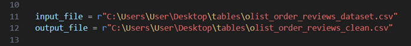
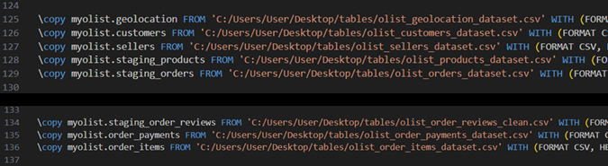
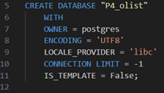
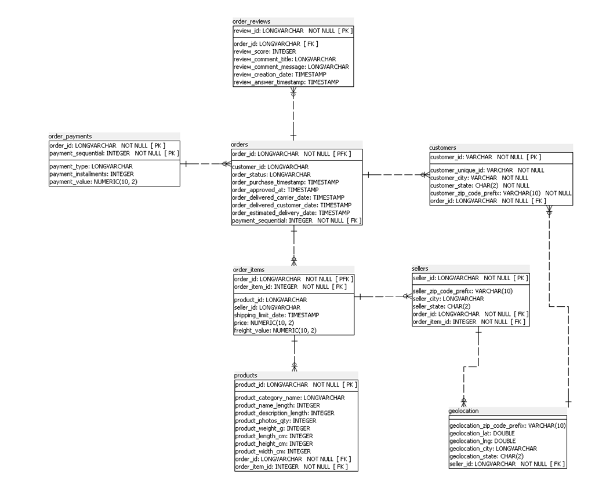
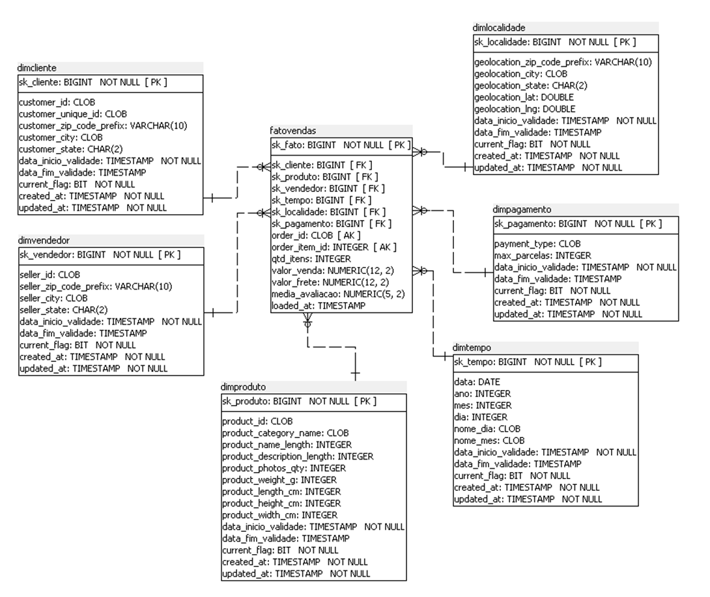

# Análise de Dados – Brazilian E-Commerce (Olist)

## 1. Descrição do Dataset e Objetivo da Análise

### Dataset Selecionado

**Olist – Brazilian E-Commerce Public Dataset**  
Disponível em: https://www.kaggle.com/datasets/olistbr/brazilian-ecommerce

### Descrição do Dataset

O Brazilian E-Commerce Public Dataset by Olist contém informações sobre aproximadamente **100 mil pedidos** realizados na plataforma entre **2016 e 2018**.

O dataset é composto por múltiplas tabelas relacionais:

- Clientes  
- Pedidos  
- Itens dos pedidos  
- Produtos  
- Vendedores  
- Avaliações  
- Pagamentos  

---

### Objetivo do Negócio

A análise tem como principais objetivos:

- Avaliar a evolução temporal das vendas  
- Analisar a participação das categorias por Estado  
- Identificar os clientes que geram maior receita  
- Entender o perfil de pagamento  
- Calcular gasto médio  
- Visualizar geograficamente onde ocorrem as vendas  

Com esses insights, busca-se:

- Otimizar a performance dos vendedores  
- Segmentar clientes para campanhas mais eficazes  
- Monitorar a satisfação via avaliações  
- Melhorar gestão de estoque e logística  
- Ajustar estratégias de preço  
- Prever demandas futuras  
- Avaliar eficiência de frete e pagamentos  

---

## 2. ⚙️ Criação e Importação dos Dados Operacionais

### 🧹 Etapa 1 – Tratamento do CSV de Reviews

Com os arquivos `.csv` salvos localmente, execute o script:

```bash
python clean_csv_olist_reviews.py
```

Este script remove caracteres inválidos (como emojis) que podem gerar erros de codificação UTF-8 no campo de reviews.

**Importante:**
- Alterar as linhas 11 e 12 do script
- Ajustar os caminhos de:
  - `input_file`
  - `output_file`
- Apontar corretamente para o arquivo `olist_order_reviews_dataset.csv`

---



### 🗄️ Etapa 2 – Criação das Tabelas e Importação

Após executar o script de limpeza, rode o seguinte comando no terminal ou no PSQL Tool:

```bash
psql -U postgres -f "C:\Users\User\Desktop\criacao_importacao.sql"
```

🔧 **Atenção:**

- Substituir o caminho pelo local correto do arquivo `criacao_importacao.sql`
- Ajustar o usuário caso não seja `postgres`
- Dentro do script `criacao_importacao.sql`, alterar:
  - Caminhos dos comandos `\copy`
  - Usuário do banco (se necessário)





---

## 3. Modelo da Base Operacional (Fonte)

Imagem do modelo relacional da base operacional:



---

## 4. Modelo Dimensional (Destino)

Imagem do modelo dimensional (Data Warehouse):



---

## 5. Scripts SQL – Processo de ETL

Executar o script:

```bash
psql -U postgres -f "C:\Users\User\Desktop\criacao_dimensional.sql"
```

🔧 Ajustar:
- Caminho do arquivo
- Usuário do banco (caso diferente de `postgres`)

### Visualizar View Gerada

```sql
SELECT * FROM datamart.vw_fatovendas_expandido;
```

---

## 6. 📊 Consultas com Funções Analíticas

Arquivo:

```
consultas.sql
```

As análises incluem:

### 1. Total de vendas por ano, mês e estado  
- Utiliza `ROLLUP`

### 2. Total de vendas por categoria, estado e ano  
- Utiliza `CUBE`

### 3. Top 10 clientes com maior valor de compras  
- Utiliza `RANK`

### 4. Média mensal de vendas por estado e categoria  
- Utiliza `DENSE_RANK` e `FIRST_VALUE`

### 5. Evolução do valor médio mensal das vendas  
- Utiliza `ROW_NUMBER`, `LAG` e `LEAD`

---

## 7. Dashboard de Visualização

A visualização foi desenvolvida no Power BI.

Arquivo:

```
Graficos_BI.pbix
```

O dashboard contém cinco visuais principais:

- Tendência temporal das vendas  
- Distribuição por categoria e estado  
- Ranking dos 10 maiores clientes  
- Valor médio dos pedidos por forma de pagamento  
- Mapa geográfico das vendas  
